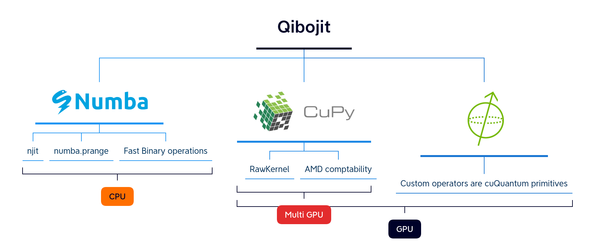

# Towards a hybrid quantum operating system

Andrea Pasquale on the behalf of the Qibo collaboration

9th May 2023, CHEP2023, Norfolk

---
transition: fade-out
---


---

# What is the challenge?

## 
<p align="center">

<em> Is it possible to create from scratch a framework for all of this?</em>
</p>


---
transition: slide-up

layout: center
class: text-center

---

# Introducing Qibo

Open-source full stack API for quantum simulation, hardware control and calibration

---
transition: slide-left
---

<p align="center">

</p>

---
transition: slide-left


layout: center
class: text-center
---

# Simulation

---
layout: two-cols
---
# Gate set abstraction
## 

```python
import numpy as np
from qibo.models import Circuit
from qibo import gates, set_backend

# Set driver engine
set_backend("numpy")

c = Circuit(2)
c.add(gates.X(0))

# Add a measurement register on both qubits
c.add(gates.M(0, 1))

# Execute the circuit with the default initial state |00>.
result = c(nshots=100)
```

```python
# Change backend 
set_backend("qibojit")

# Circuit execution with new driver
result = c(nshots=100)
```


<template v-slot:right>

## Qibo features

<ul>
<li><p>Definition of a <b> standard language </b> for the construction and execution of quantum circuits with <b>device agnostic approach</b> to simulation and quantum hardware control based on plug and play backend drivers.</p></li>
<li><p>A <b>continuously growing</b> code-base of quantum algorithms applications presented with examples and tutorials.</p></li>
<li><p><b>Efficient simulation</b> backends with GPU, multi-GPU and CPU with multi-threading support.</p></li>
<li><p>A Simple mechanism for the implementation of <b>new simulation and hardware backend drivers</b>.</p></li>
</ul>
</template>

---

# High performance simulation
##

❌ <b>Long</b> computational times using naive approach (`Numpy` or `TensorFlow`) for circuits with <b>large</b> number of qubits.

✅ We need more sophisticated tools to be able to simulate a quantum circuits with more qubits! 

<p align="center">

</p>


---

# Benchmark
##

<p align="center">

</p>

All the benchmarks are available in [qibojit-benchmarks](https://github.com/qiboteam/qibojit-benchmarks).

---
layout: center
class: text-center
---

# Qibolab
Automatic deployment of quantum circuits on quantum hardware


---
layout: two-cols
---

<template v-slot:default>

## Motivation


&rarr; We need both a Pulse Level API + Drivers to interface Qibo with different instruments.

</template>
<template v-slot:right>
<p align="center">


</p>
</template>


---
layout: two-cols
---
## Pulse API example
```python
from qibolab import Platform
from qibolab.pulses import ReadoutPulse, PulseSequence

# Define PulseSequence
sequence = PulseSequence()
# Add some pulses to the pulse sequence
sequence.add(ReadoutPulse(start=0,
                   amplitude=0.3,
                   duration=4000,
                   frequency=200_000_000,
                   shape='Gaussian(5)'))

# Define platform
platform = Platform("tii1q_b1")
# Platform setup
platform.connect()
platform.setup()
platform.start()
# Executes a pulse sequence.
results = platform.execute_pulse_sequence()
platform.stop()
platform.disconnect()
```
<template v-slot:right>

## Drivers implemented
<p align="center">


</p>
</template>

---
transition: slide-up
layout: center
class: text-center
---


# Introducing Qibocal
A reporting tool for calibration using Qibo


---

# Motivation
## 

Let's suppose the following:
<ol>
<li><p>We have a QPU (self-hosted).</p></li>
<li><p>We have control over what I send to the QPU.</p></li>
<li><p>We know how to convert Pulses to Circuits. </p></li>
</ol>

Can I **trust** my results? **NO!**


**Characterization** and **calibration** are an essential step to properly operate emerging quantum devices.


<p align="center">

<em> Calibration of RX pulse amplitude through a Rabi experiment through Qibocal</em>.
</p>


---

# Single Qubit Characterization: Pulse Level
## 
<p align="center">

</p>


---

# Single Qubit Characterization: Circuit Level
## 

<div class="row">
  <div class="column">
    
  </div>
  <div class="column">
    
  </div>
</div>

---

# Reporting tools
## 
<p align="center">

</p>
---
layout: center
class: text-center
---

# Applications

---

# Paramater Shift Rule on Hardware
##
What can we achieve using `Qibo` + `Qibolab` + `Qibocal`?

Successfully performed a gradient descent on a QPU with a single using Parameter Shift Rule algorithm.

<p align="center">

</p>

---
layout: center
class: text-center
---

# Outlook

---

Qibo is growing to accomodate different tasks:

<ul>
<li><p>High performance quantum simulation: qibojit.</p></li>
<li><p>Hardware control: qibolab</p></li>
<li><p>Hardware calibration: qibocal</p></li>
<li><p>A Simple mechanism for the implementation of new simulation and hardware backend drivers.</p></li>
</ul>


<!-- <ul>
<li><p>High performance quantum simulation: qibojit.</p></li>
<li><p>Hardware control: qibolab</p></li>
<li><p><b>Hardware calibration: qibocal</p></li>
<li><p>A Simple mechanism for the implementation of <b>new simulation and hardware backend drivers</b>.</p></li>
</ul> -->


- Publicly available as an open source project
- Modular layout design with the possibility of adding
  - new backends for simulation
  - new backends for hardware control
- Community driven effort


---
layout: center
class: text-center
---

# Thanks for listening!