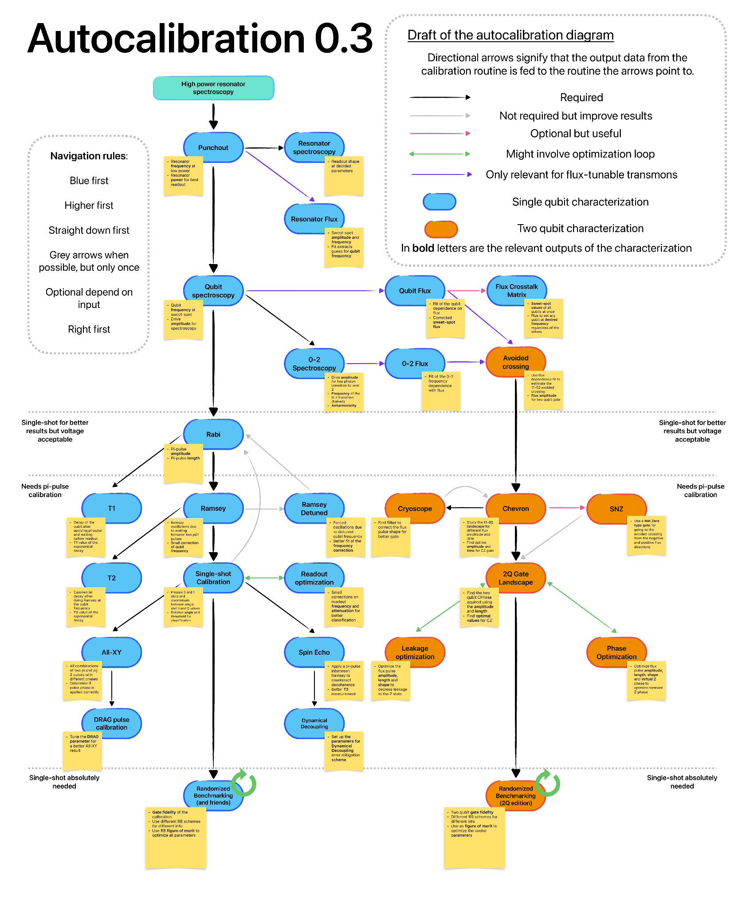
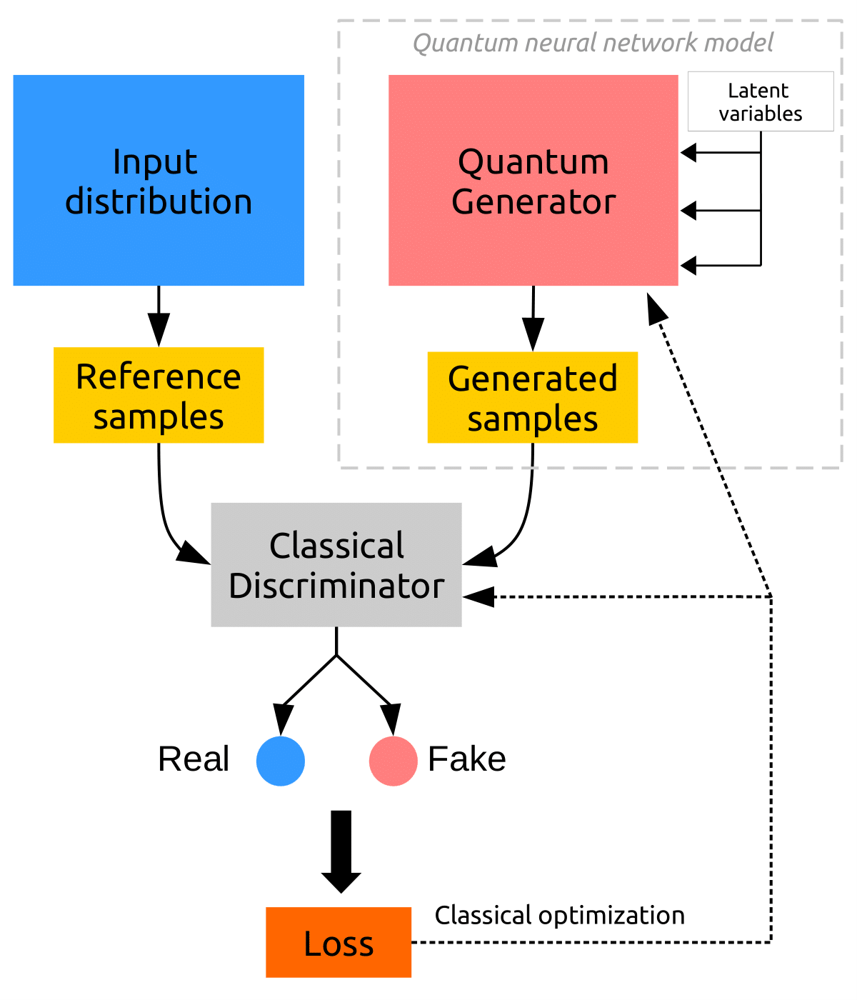
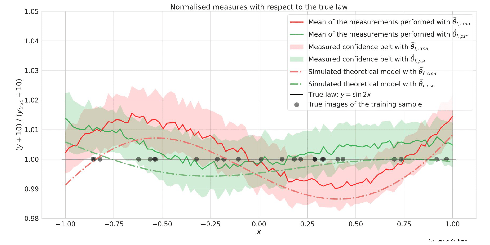

# Brief introduction on the Qibo framework

Andrea Pasquale

8th September 2023

<br>
<br>
<div class="row">
  <div class="column3">
    
  </div>
  <div class="column3">
    
  </div>
  <div class="column3">
    
  </div>
</div>

---

# How can we start using Quantum Computing?

##
<p align="center">

<em> Is it possible to create <strong> from scratch </strong> a framework for all of this?</em>
</p>

---

# Are re-inventing the wheel?

##

You *could* say so however, compared to our competitors we have different priorities

1. Full open-source approach

2. Academic driven

3. Solutions for self-hosted Quantum Computers

<p align="center">

</p>

---
transition: slide-up

layout: center
class: text-center

---

# Introducing Qibo

Open-source full stack API for quantum simulation, hardware control and calibration

---
transition: slide-left
---

<p align="center">

</p>

---

# Who is using Qibo?

##

<p align="center">

</p>
---
transition: slide-left

layout: center
class: text-center
---

# Simulation

---
layout: two-cols
---
# Gate set abstraction
##

```python
import numpy as np
from qibo.models import Circuit
from qibo import gates, set_backend

# Set driver engine
set_backend("numpy")

c = Circuit(2)
c.add(gates.X(0))

# Add a measurement register on both qubits
c.add(gates.M(0, 1))

# Execute the circuit with the default initial state |00>.
result = c(nshots=100)
```

```python
# Change backend
set_backend("qibojit")

# Circuit execution with new driver
result = c(nshots=100)
```


<template v-slot:right>

## Qibo features

<ul>
<li><p>Definition of a <b> standard language </b> for the construction and execution of quantum circuits with <b>device agnostic approach</b> to simulation and quantum hardware control based on plug and play backend drivers.</p></li>
<li><p>A <b>continuously growing</b> code-base of quantum algorithms and applications presented with examples and tutorials.</p></li>
<li><p><b>Efficient simulation</b> backends with GPU, multi-GPU and CPU with multi-threading support.</p></li>
<li><p>A simple mechanism for adding <b>new simulation and hardware backend drivers</b>.</p></li>
</ul>

<p align="right">
<a href="https://arxiv.org/abs/2009.01845">2009.01845</a>
</p>
</template>

---

# Simulating circuits with large number of qubits

##

<p align="center">

</p>

---

# High performance simulation
##

❌ <b>Long</b> computational times using naive approach (`Numpy` or `TensorFlow`) for circuits with <b>large</b> number of qubits.

✅ We need more sophisticated tools to be able to simulate quantum circuits with more qubits!

<p align="center">

</p>


<p align="right">
<a href="https://arxiv.org/abs/2203.08826">2203.08826</a>
</p>


---

<p align="center">

</p>

---

# Benchmark
##

<p align="center">

</p>

All the benchmarks are available in [qibojit-benchmarks](https://github.com/qiboteam/qibojit-benchmarks).

---
layout: center
class: text-center
---

# What about execution on quantum hardware?

---

<p align="center">

</p>

---

# How can we execute algorithms on quantum hardware?

##

<p align="center">

</p>

<p align="center">

</p>
---

# Introducing Qibolab

##

<p align="center">

</p>


---
layout: two-cols
---
## Pulse API example
```python
from qibolab import Platform
from qibolab.pulses import ReadoutPulse, PulseSequence

# Define PulseSequence
sequence = PulseSequence()
# Add some pulses to the pulse sequence
sequence.add(ReadoutPulse(start=0,
                   amplitude=0.3,
                   duration=4000,
                   frequency=200_000_000,
                   shape='Gaussian(5)'))

# Define platform
platform = Platform("tii1q_b1")
# Platform setup
platform.connect()
platform.setup()
platform.start()
# Executes a pulse sequence.
results = platform.execute_pulse_sequence()
platform.stop()
platform.disconnect()
```
<template v-slot:right>

## Drivers implemented

Currently Qibolab supports the following drivers:

<ul>
<li><p>Qblox</p></li>
<li><p>Quantum Machines</p></li>
<li><p>Zurich Instruments</p></li>
<li><p> FPGAs (based on Qick)</p></li>

</ul>

We also support local oscillators
<ul>
<li><p>RohdeSchwarz SGS100A</p></li>
<li><p>ERASynth</p></li>
</ul>

<p align="right">
<a href="https://arxiv.org/abs/2308.06313">2308.06313</a>
</p>
</template>

---
transition: slide-up
layout: center
class: text-center
---


# Introducing Qibocal
A reporting tool for calibration using Qibo


---


# Motivation
##
Let's suppose the following:
<ol>
<li><p>We have a QPU (self-hosted).</p></li>
<li><p>We have control over what we send to the QPU.</p></li>
<li><p>We know how to convert quantum circuits to pulses. </p></li>
</ol>

Can I **trust** my results? **NO!**


**Characterization** and **calibration** are an essential step to properly operate emerging quantum devices.


<p align="center">

<em> Calibration of RX pulse amplitude through a Rabi experiment in Qibocal</em>.
</p>


---

# Single Qubit Characterization
##
<p align="center">

</p>

---

# Towards automation

<div style="display:block; width:100%;">
  <div style="width:30%; float: left; display: inline-block;">
  <ul>
    <li><p>Specify a direct acyclic graph with various experiments</p></li>
    <li><p>Parameters computed are fed from one routine to the next</p></li>
    <li><p>Full pipeline for recalibration implemented starting
    from resonator specotropy at low power</p></li>
    </ul></div>
  <div style="width:70%; float: left; display: inline-block;">
  <p align="center">

</p>
</div>
</div>

---


---
layout: center
class: text-center
---

# Applications

---

## Determination of parton distribution functions using QML  <a href="https://arxiv.org/abs/2011.13934">2011.13934</a>


<p align="center">


</p>
---
layout: two-cols
---

## MonteCarlo event generator using QGAN

<p align="center">

<br>
<br>
<br>
<em> Style-based approach </em>

</p>


<template v-slot:right>

<p align="center">

</p>

<p align="right">
<a href="https://arxiv.org/abs/2110.06933">2110.06933</a>
</p>

</template>

---

## Results with $pp \rightarrow t \bar{t}$

<p align="center">

<br>
<em> Implementation largely hardware independent! </em>

</p>

---
layout: center
class: text-center
---

# Outlook

---

# Where are we now?

##
<p align="center">

</p>


---
layout: center
class: text-center
---

# Thanks for listening!


---
layout: center
class: text-center
---

# Backup slides

---

# Fitting PDFs using adiabatic evolution
##

Use quantum adiabatic machine learning for the determination of PDF and sampling.

<div class="row">
  <div class="column">
    <div class="vertical-center">
    
    </div>
  </div>
  <div class="column">
    

  </div>
</div>

<p align="right">
<a href="https://arxiv.org/abs/2303.11346">2303.11346</a>
</p>


---

# Paramater Shift Rule on Hardware
##

Successfully performed a gradient descent on a QPU with a single using Parameter Shift Rule algorithm.

<p align="center">

</p>

<p align="right">
<a href="https://arxiv.org/abs/2210.10787">2210.10787</a>
</p>
