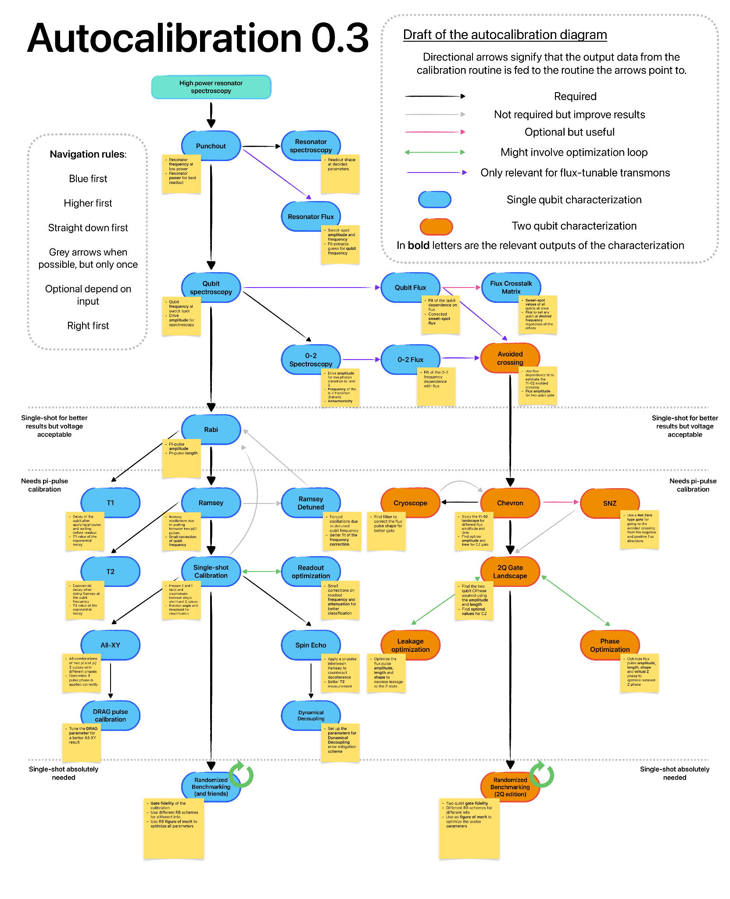

# Qibocal introduction

Andrea Pasquale

18th September 2023

<br>
<br>
<div class="row">
  <div class="column3">
    
  </div>
  <div class="column3">
    
  </div>
  <div class="column3">
    
  </div>
</div>

---


<p align="center">

</p>

---
transition: slide-up
layout: center
class: text-center
---

# A snapshot of Qibolab
---


##

<p align="center">

</p>


---
layout: two-cols
---
## Pulse API example
```python
from qibolab import create_platform
from qibolab.pulses import ReadoutPulse, PulseSequence
from qibolab.execution_parameters import ExecutionParameters
# Define PulseSequence
sequence = PulseSequence()
# Add some pulses to the pulse sequence
sequence.add(ReadoutPulse(start=0, amplitude=0.3,
                   duration=4000, frequency=200_000_000,
                   shape='Gaussian(5)'))
# Define platform
platform = create_platform("tii1q")
# Platform setup
platform.connect()
platform.setup()
platform.start()
# Define options and execute pulse sequence
options = ExecutionParameters(nshots=1000,
                              relaxation_time=100)
res = platform.execute_pulse_sequence(sequence,
                                      options=options)

platform.stop()
platform.disconnect()
```
<template v-slot:right>

## Drivers implemented

Currently Qibolab supports the following drivers:

<ul>
<li><p>Qblox</p></li>
<li><p>Quantum Machines</p></li>
<li><p>Zurich Instruments</p></li>
<li><p> FPGAs (based on Qick)</p></li>

</ul>

We also support local oscillators
<ul>
<li><p>RohdeSchwarz SGS100A</p></li>
<li><p>ERASynth</p></li>
</ul>

<p align="right">
<a href="https://arxiv.org/abs/2308.06313">2308.06313</a>
</p>
</template>

---
transition: slide-up
layout: center
class: text-center
---


# Introducing Qibocal

A reporting tool for calibration using Qibo and Qibolab


---

# How to use Qibocal?

##

<p align="center">

</p>

---

# Calibration protocols currently implemented
##
<p align="center">

</p>

---

# Towards automation

<div style="display:block; width:100%;">
  <div style="width:30%; float: left; display: inline-block;">
  <ul>
    <li><p>Specify a direct acyclic graph with various experiments</p></li>
    <li><p>Parameters computed are fed from one routine to the next</p></li>
    <li><p>Full pipeline for recalibration implemented starting
    from resonator specotropy at low power</p></li>
    </ul></div>
  <div style="width:70%; float: left; display: inline-block;">
  <p align="center">

</p>
</div>
</div>


---
layout: iframe

# the web page source
url: https://qibo.science/qibocal/latest/tutorials/protocol.html

---
---
layout: iframe

# the web page source
url: https://qibo.science/qibocal/latest/getting-started/runcard.html

---

---
layout: iframe

# the web page source
url: http://login.qrccluster.com:9000/

---


---
transition: slide-up
layout: center
class: text-center
---

# Thanks for listening!
Questions?